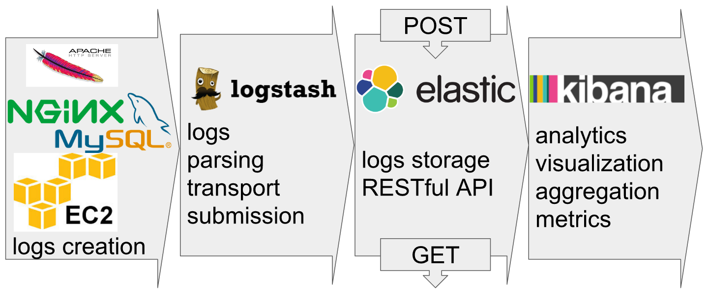

[comment]: # (I commented the two following lines to generate the PDF and added the content myself onto the PDF afterwards)

#### HEIG-VD CLD-2016 Elastic Search Summary

[Fabien Salathe](https://github.com/BafS), [Sacha Bron](https://github.com/BinaryBrain), [Valentin Minder](https://github.com/ValentinMinder), [Léonard Berney](https://github.com/D34D10CK)

##### Architecture

- Ready-to-use RESTful API for submitting and retrieving logs from multiple servers
- Abstraction and wrappers with logstatch (for transport and parsing of most application: Apache...) 
- Real-time data gathering, visualisation and aggregation: with kibana plugin 

- **RESTful** JSON API / Open source / Fast deployement / Aggregation / Designed to be distributed / **Query DSL syntax** is really flexible and easy to use
- easy to use Query language/Search capacities: general search or specific field / choose what fields to output / usual condition (AND, OR, NOT, ranges) / even easier with kibana visualisation

##### Cons:

- Still relatively **new project**, not a lot of documentations, maybe not very stable.
- **Security**: ElasticSearch does not provide any authentication or access control functionality
- **Transactions**: There is no support for transactions or processing on data manipulation
- **Durability**: ES is distributed and fairly stable but backups and durability are not as high priority as in other data stores. This is probably the most important if you're going to make ES the primary store since losing your data is never good.

##### Use Elastic Search as a service : Pros Amazon (or generally other providers)

- All logs accessible in one place - Nothing to install – use any log shipper you want
- Hassle-free managed ELK you don’t need to maintain and scale
- Use built-in Kibana or use your own Kibana or Grafana with Logsene
- price: pay-as-you-go and per-service (no IT & infrastructure, maintanance, etc)
- price are low if the logs are from local Amazon source, transfer to or from the internet costs.

##### Cons Amazon / Pros ELK Full-stack in IT dept.

- version of Elasticsearch: not choosable, and Elasticsearch 1.5.x and other versions have critical bugs
- less flexible with library support, the technology moves fast!
- limited choices in terms of VM characteristics: (type, disk size, RAM)
- requires cloud usage (country and legal issues, technical issues with traffic/bandwidth)

